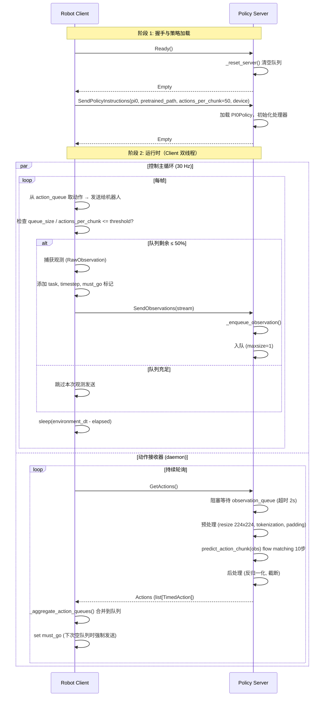
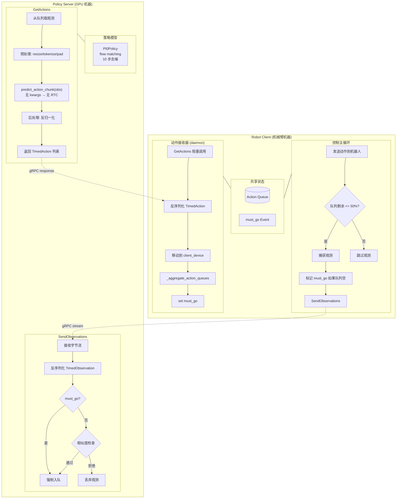

# LeRobot 异步推理架构分析：Pi0 + PolicyServer + RobotClient

## 架构概览

两个独立进程通过 **gRPC** 通信，定义了 4 个 RPC：

```protobuf
service AsyncInference {
  rpc SendObservations(stream Observation) returns (Empty);   // Client → Server
  rpc GetActions(Empty) returns (Actions);                     // Client ← Server
  rpc SendPolicyInstructions(PolicySetup) returns (Empty);     // Client → Server (one-shot)
  rpc Ready(Empty) returns (Empty);                            // 握手
}
```

- **RobotClient**：运行在机械臂所在机器，负责捕获观测、执行动作
- **PolicyServer**：运行策略模型（如 Pi0），通常在带 GPU 的机器上

---

## 完整消息流

### 阶段 1 — 握手与策略加载

1. Client 连接机械臂硬件，打开 gRPC 通道
2. Client 调用 `stub.Ready(Empty())` → Server 调用 `_reset_server()`：清空观察队列、重置预测时间戳
3. Client 发送 `RemotePolicyConfig`（pickle 序列化），包含：
   - `policy_type="pi0"`
   - `pretrained_name_or_path`
   - `actions_per_chunk`
   - `device`
4. Server 反序列化配置 → `get_policy_class("pi0")` → `PI0Policy` → 加载权重 → 移动至目标设备 → 初始化预处理/后处理器

### 阶段 2 — 运行时（Client 双线程）

| 线程 A：控制主循环 (30 Hz) | 线程 B：动作接收器 (daemon) |
|---|---|
| 从动作队列取动作 → 发送给机器人 | 调用 `GetActions()` 阻塞等待 Server |
| 队列剩余 ≤ 50% 时 → 捕获观测 → 发给 Server | 收到动作块 → 聚合到队列 |

两个线程通过 `Barrier(2)` 同步，共享一个动作队列 (`action_queue`)。

### 阶段 3 — Server 端推理流程

```
GetActions() 被调用
  → 从 observation_queue 取观测（超时 2s，超时则返回空）
  → 预处理：
      - 图像 resize 到 224x224，归一化到 [-1, 1]
      - 语言指令 tokenization → observation.language.tokens / attention_mask
      - 状态向量 padding 到 max_state_dim=32
  → self.policy.predict_action_chunk(observation)
      - Pi0：flow matching，10 步去噪
  → 后处理：反归一化，截取 actions_per_chunk
  → 返回带时间戳的 TimedAction 列表
```

---

## 关键发现：异步推理中 Pi0 的 RTC 不会生效

### 证据

`policy_server.py:_get_action_chunk()` 中的调用：

```python
chunk = self.policy.predict_action_chunk(observation)  # ← 没有传递任何 kwargs
```

Pi0 的 `predict_action_chunk` 签名虽然接受可选参数：

```python
def predict_action_chunk(self, batch: dict[str, Tensor], **kwargs: Unpack[ActionSelectKwargs]) -> Tensor:
    # ActionSelectKwargs:
    #   inference_delay: int | None
    #   prev_chunk_left_over: Tensor | None
    #   execution_horizon: int | None
```

但 Policy Server **一个都没传**，全部为 `None`。因此：

- `inference_delay=None` → 无推理延迟补偿
- `prev_chunk_left_over=None` → 无前一步动作引导
- `execution_horizon=None` → 使用默认值

RTC 前缀引导在异步模式下处于**休眠状态**。

### RTC 实际在哪里使用？

RTC (Real-Time Chunking) 只在 `lerobot-rollout --inference.type=rtc` 的**单进程**路径中使用（`src/lerobot/rollout/inference/rtc.py`）：

```python
# rtc.py:307-308
self._policy.predict_action_chunk(
    preprocessed, inference_delay=delay, prev_chunk_left_over=prev_actions
)
```

`RTCInferenceEngine` 管理一个 `ActionQueue`，跟踪延迟并计算 `delay = ceil(latency / time_per_chunk)`，然后用前一步剩余动作引导当前去噪。

---

## 异步模式如何保持动作连续性？

既然不用 RTC，异步模式通过 **Client 端动作聚合** 来实现chunk间的平滑过渡：

### 聚合逻辑 (`_aggregate_action_queues`)

```python
for incoming_action in received_actions:
    if action.timestep <= latest_action:
        continue  # 已执行，跳过
    elif action.timestep not in current_queue:
        add_directly()  # 新时间步，直接加入
    else:
        # 重叠部分：用聚合函数融合新旧预测
        queue[timestep] = aggregate_fn(old, new)
```

### 可用聚合函数

| 名称 | 公式 | 行为 |
|------|------|------|
| `weighted_average`（默认） | `0.3 * old + 0.7 * new` | 偏向新预测 |
| `latest_only` | `new` | 完全替换 |
| `average` | `0.5 * old + 0.5 * new` | 等权融合 |
| `conservative` | `0.7 * old + 0.3 * new` | 偏向旧预测 |

### `must_go` 防停滞机制

```python
# Client 端 control_loop_observation:
observation.must_go = self.must_go.is_set() and self.action_queue.empty()

# Server 端 _enqueue_observation:
if obs.must_go:
    # 强制入队，绕过相似度过滤
```

当动作队列为空时，下一帧观测被标记为 `must_go`，确保 Server 必须处理它，防止系统停滞。收到新动作后，Client 会重新设置 `must_go`，形成循环保护。

---

## 三个核心参数详解

| 参数 | 默认值 | 位置 | 作用 |
|------|--------|------|------|
| `actions_per_chunk` | (必须指定) | RobotClientConfig | Server 截断 Pi0 输出的 chunk 大小。设 50 ≈ 1.7s 缓冲 (50/30Hz) |
| `chunk_size_threshold` | 0.5 | RobotClientConfig | 队列剩余比例 ≤ 此值时才发新观测。0.5 = 半满时触发下一次请求 |
| `aggregate_fn_name` | weighted_average | RobotClientConfig | 重叠动作的融合方式 |

**参数调优建议：**

- `actions_per_chunk=50`：一次获取约 1.7s 的动作缓冲，SSH 隧道也不易卡顿
- `chunk_size_threshold=0.5`：队列剩 25 个动作时提前请求下一次，留出网络延迟余量
- `chunk_size_threshold` 调大 → 更频繁推理，环境适应性更强，但增加 Server 负载
- `chunk_size_threshold` 调小 → 接近同步执行，每批动作全部用完才请求新推理

---

## Pi0 vs ACT 在异步模式中的对比

| 方面 | Pi0 | ACT |
|------|-----|-----|
| `predict_action_chunk` 签名 | `(batch, **kwargs)` | `(batch)` — 不接受 kwargs |
| 推理方式 | Flow matching（10 步去噪） | 单次前向传播（CVAE） |
| 语言输入 | 需要 `observation.language.tokens` | 不需要 |
| 图像预处理 | Resize 到 224x224，SigLIP 归一化 | 标准归一化 |
| 状态/动作维度 | Padding 到 max_state_dim=32 | 使用实际维度 |
| RTC 支持 | 内置（但异步模式下休眠） | 无 |
| 异步模式调用 | `predict_action_chunk(obs)` 无 kwargs | `predict_action_chunk(obs)` 无 kwargs |

**结论**：在 PolicyServer + RobotClient 异步模式下，Pi0 和 ACT 的调用方式**完全相同**。Pi0 的 RTC 能力在异步模式中没有被利用，动作连续性完全依赖 Client 端的聚合函数来保证。

---

## 完整架构图



## 组件结构图



---

## 远程部署常见问题

### Client 连接 Server 后机械臂不动

**症状：** PolicyServer 和 RobotClient 都启动了，但机械臂没有动作。

**排查步骤：**

1. **确认 SSH 隧道已建立：**
   ```bash
   ssh -L 8088:127.0.0.1:8088 user@remote_server
   ```
   Server 绑定 `127.0.0.1:8088`（仅本机），必须通过 SSH 隧道让本地 Client 能访问。

2. **Client 必须配置 `--robot.cameras`：**
   如果模型训练时使用了图像数据，Client 端机器人也必须配置摄像头，否则 `lerobot_features` 中缺少图像特征，Server 端预处理器无法匹配。
   ```bash
   --robot.cameras="{ front: {type: opencv, index_or_path: 0, width: 1920, height: 1080, fps: 30}}"
   ```

3. **确认 `--pretrained_name_or_path` 是远程服务器上的路径：**
   模型在 Server 端加载，路径必须是 Server 文件系统上的路径（如 `/root/lerobot/outputs/...`），不是本地 mac 的路径。

4. **查看 Server 端日志：**
   如果 Server 加载模型失败或推理报错，Client 端不会直接显示错误，只会看到动作队列为空。检查 Server 端终端是否有报错。

5. **确认 `actions_per_chunk` 匹配：**
   Client 和 Server 使用的 `actions_per_chunk` 必须一致（Client 通过 RPC 发送给 Server）。如果模型训练的 `chunk_size=50`，建议 `actions_per_chunk` 也设为 50。

### `lerobot-rollout` 能工作，但 PolicyServer + RobotClient 不工作

`lerobot-rollout --strategy.type=base` 是**单进程本地推理**，策略和机器人在同一个进程中直接通信，不需要网络、不需要特征序列化/反序列化。

PolicyServer + RobotClient 是**分离式架构**：
- Client 采集观测 → 序列化 → gRPC 发送 → Server 反序列化 → 推理 → 序列化 → 发送回 Client
- 观测特征必须通过 `RemotePolicyConfig.lerobot_features` 在两端对齐
- 任何特征不匹配（如缺少摄像头、键名不一致）都会导致推理失败

> **重要：** PolicyServer 的 CLI **只接受网络参数**（host、port、fps 等）。策略类型、模型路径、设备、`actions_per_chunk` 等参数由 RobotClient 通过 `SendPolicyInstructions` RPC 在握手时发送给 Server，**不需要也不应该**作为 Server 的命令行参数。

**Policy Server（只配置网络）：**

```bash
uv run python -m lerobot.async_inference.policy_server \
    --host=127.0.0.1 \
    --port=8080 \
    --fps=30 \
    --inference_latency=0.033 \
    --obs_queue_timeout=2
```

Server 启动后处于"等待连接"状态，不加载任何模型。当第一个 RobotClient 连接并发送 `RemotePolicyConfig` 后，Server 才会加载对应的策略。

**Robot Client（配置策略 + 网络 + 机器人）：**

```bash
uv run python -m lerobot.async_inference.robot_client \
    --robot.type=so101_follower \
    --robot.port=/dev/tty.usbmodem5B7B0137181 \
    --robot.id=my_awesome_follower_arm \
    --robot.cameras="{ front: {type: opencv, index_or_path: 0, width: 1920, height: 1080, fps: 30}}" \
    --task="grasp orange" \
    --server_address=127.0.0.1:8080 \
    --policy_type=pi0 \
    --pretrained_name_or_path=/root/.cache/modelscope/hub/models/lerobot/pi0_base \
    --policy_device=cuda \
    --actions_per_chunk=50 \
    --chunk_size_threshold=0.5 \
    --aggregate_fn_name=weighted_average
```

**参数归属总结：**

| 参数 | 属于 | 说明 |
|------|------|------|
| `--host` | Server | 监听地址 |
| `--port` | Server | 监听端口 |
| `--fps` | Server | 目标 FPS |
| `--inference_latency` | Server | 每次推理的目标延迟预算 |
| `--obs_queue_timeout` | Server | GetActions 等待观测的超时时间 |
| `--policy_type` | Client | 通过 RPC 发送给 Server |
| `--pretrained_name_or_path` | Client | 通过 RPC 发送给 Server |
| `--policy_device` | Client | 通过 RPC 发送给 Server |
| `--actions_per_chunk` | Client | 通过 RPC 发送给 Server |
| `--client_device` | Client | 仅 Client 使用 |
| `--chunk_size_threshold` | Client | 仅 Client 使用 |
| `--aggregate_fn_name` | Client | 仅 Client 使用 |
| `--server_address` | Client | 连接 Server 的地址 |
| `--robot.*` | Client | 仅 Client 使用 |
